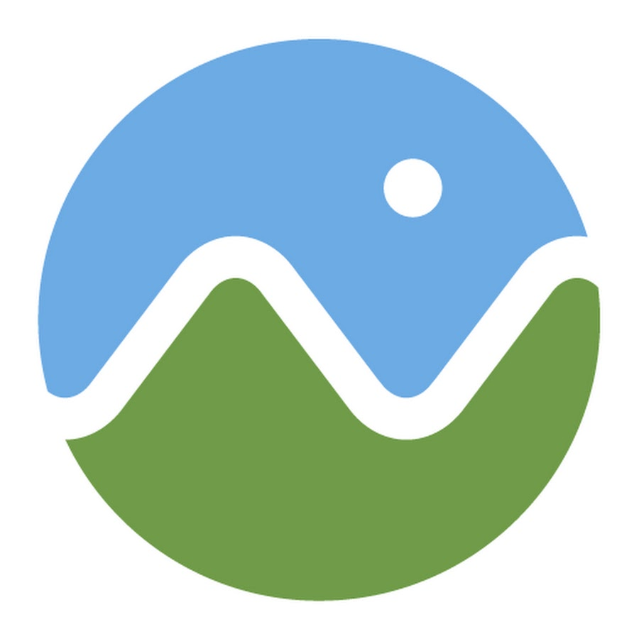

<h1 align="center">
  
</h1>

 

  Hi, I'm <b>Ahmed Badawi</b>  
   
  🌍 WebGIS Developer  
   
  💻 Full Stack Developer (Node.js + Angular)  
   
  🗺️ Specialized in Spatial Systems, Smart Cities & GIS Solutions  
   
  📚 Passionate about geospatial analysis, 3D maps, and backend engineering  

<h2 align="center">🔥 Skills & Tools 🔥</h2>
 

  <!-- Languages -->
  <code></code>
  <code></code>
  <code></code>
  <code></code>
  <code></code>
  <code></code>
  <code></code>
  <code></code>
  <code></code>
  <code></code>
  <code></code>
  <code></code>
  <code></code>
  <code></code>
  <code></code>
  <code></code>
  <code></code>
  <code></code>
  <code></code>
  <code></code>
  <code></code>

<h2 align="center">⚡ GitHub Stats ⚡</h2>
 

  

 

 

<h4 align="center">🔎 More Coming Soon… 🔍</h4>
